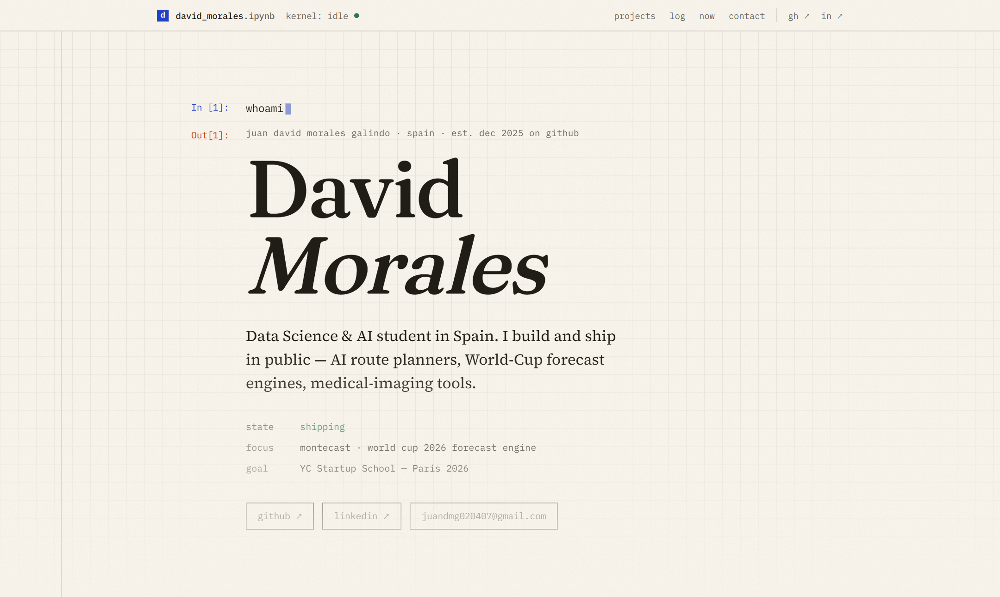

# david_morales.ipynb

My personal site — a portfolio typeset as an executable lab notebook.



## Concept

The whole page is one notebook session. The hero prompt types itself, every
section is a cell, and cells "execute" the first time they scroll into view —
the kernel indicator in the toolbar even flicks to `busy` while they run.

| Cell | What it does |
| --- | --- |
| `In [1]: whoami` | who I am, what I'm aiming at |
| `In [2]: nb.load("openroute")` | featured project — 3rd place at SEDIA's Responsible & Open AI in Industry Challenge 2026 |
| `In [3]: projects.list()` | everything else I've shipped |
| `In [4]: log.tail(7)` | the #BuildInPublic stream, newest first |
| `In [5]: github.stats()` | my real GitHub activity, re-drawn as an ink heatmap + language bars |
| `In [6]: now()` · `In [7]: contact()` | what I'm doing right now, and how to reach me |

## Stack

- **Next.js 16** (App Router) · TypeScript · **Tailwind CSS v4**
- Zero UI libraries — a hand-built design system (Fraunces, Source Serif 4,
  IBM Plex Mono on warm paper) and hand-drawn SVG illustrations instead of
  screenshots
- GitHub data is fetched at build time and revalidated daily, with a
  committed snapshot fallback so a rate limit can never break a deploy
- Open Graph image generated from the same design tokens
  (`app/opengraph-image.tsx`)
- Static output, semantic HTML, `prefers-reduced-motion` respected

## Run locally

```bash
npm install
npm run dev
```

Optionally set `GITHUB_TOKEN` (classic, no scopes needed) to fetch
contribution data over GraphQL instead of the public calendar.

## Edit the content

Everything editable lives in [`content/`](content): profile and links
(`site.ts`), projects (`projects.ts`), and the build log (`log.ts`) — add a
line there every time you ship something.

## Deploy

Import the repo in [Vercel](https://vercel.com/new) — zero configuration.

## License

[MIT](LICENSE). IBM Plex Mono is redistributed under the SIL Open Font
License (`assets/og/OFL.txt`).
